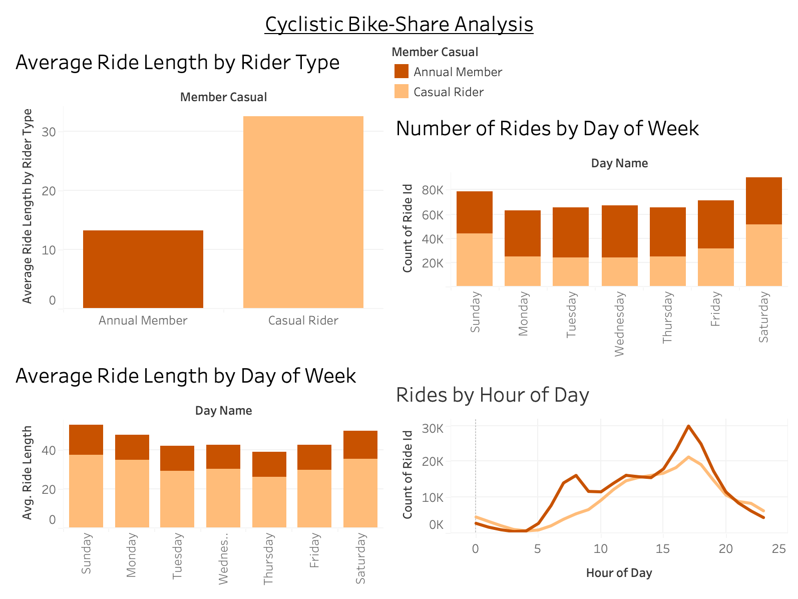

# Cyclistic Bike-Share Analysis
**Google Data Analytics Capstone Project**

**Business Question:** How do annual members and casual riders use Cyclistic bikes differently?

## Project Overview
As part of the Google Data Analytics Certificate, I analyzed 12 months of real Cyclistic (Divvy) bike-share trip data (~4.5 million rides, Jan–Dec 2021) in Chicago. The goal was to understand behavioral differences between casual riders and annual members and recommend ways to convert casual riders into annual members.

## Tools Used
* **Python** (Pandas, Matplotlib, Seaborn) — data cleaning, analysis, visualizations
* **Tableau Public** — interactive dashboard (built on the full ~4.5M rides)
* **Excel** — PivotTables and charts

## Key Insights
* Casual riders take much longer rides (avg **32.5 min**) than annual members (**13.2 min**)
* Casual riders ride mostly on weekends (leisure/tourism)
* Annual members show steady weekday usage (commuting pattern)

## Deliverables
* [Python Jupyter Notebook](https://github.com/faribakazi143/Cyclistic-Bike-Share-Analysis/blob/main/Cyclistic_Bike_Share_Analysis.ipynb)
* [Excel Analysis with PivotTables](https://github.com/faribakazi143/Cyclistic-Bike-Share-Analysis/blob/main/Cyclistic_Bike_Share_Analysis_Excel.xlsx)
* [Interactive Tableau Dashboard](https://public.tableau.com/views/CyclisticBike-ShareAnalysisFaribaKazi/CyclisticDashboard)

## Visualizations
**Average Ride Length by Rider Type** — casual riders take noticeably longer trips than members.

**Average Ride Length by Day of Week** — durations stay longest on weekends, reflecting leisure use.

**Number of Rides by Day of Week** — total volume by day, split by rider type; members dominate, with strong midweek usage.

**Rides by Hour of Day** — members show clear morning and late-afternoon commuter peaks, while casual riders stay flatter through the day.

## Top 3 Recommendations
1. Launch weekend-focused membership promotions targeting casual riders who take longer leisure rides.
2. Promote annual membership as the convenient, cost-effective choice for weekday commuters.
3. Use personalized digital campaigns (social + email) based on rider behavior patterns.

---
**Author:** Fariba Kazi · [LinkedIn](https://www.linkedin.com/in/fariba-kazi/)
