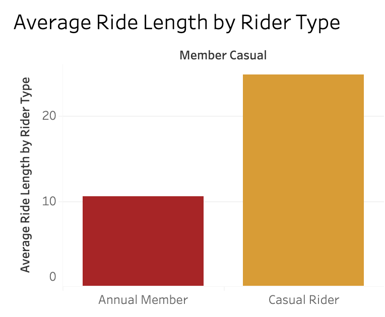
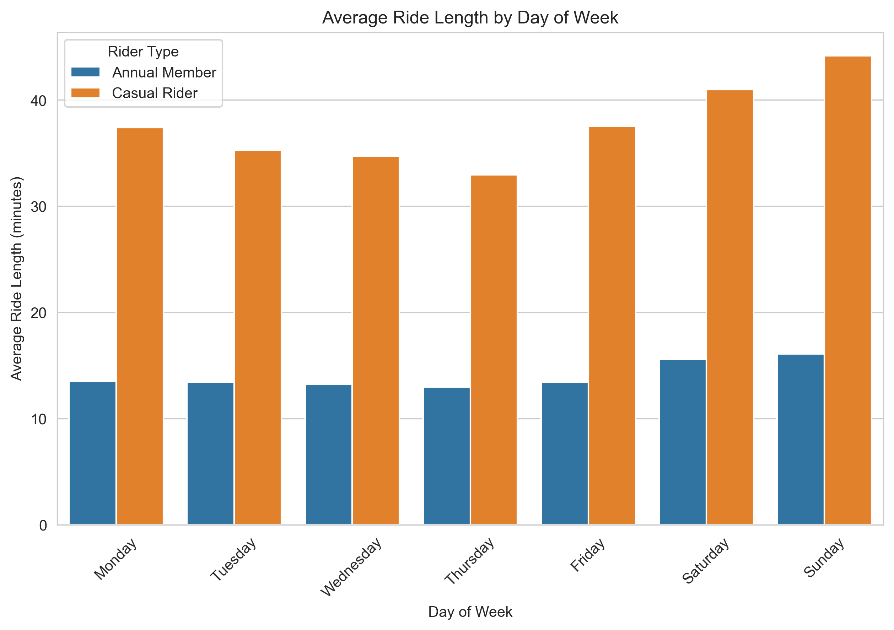
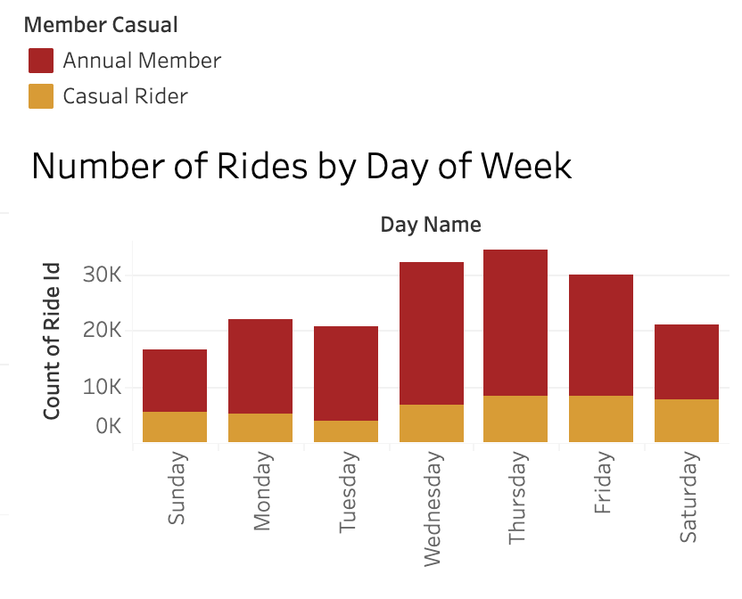
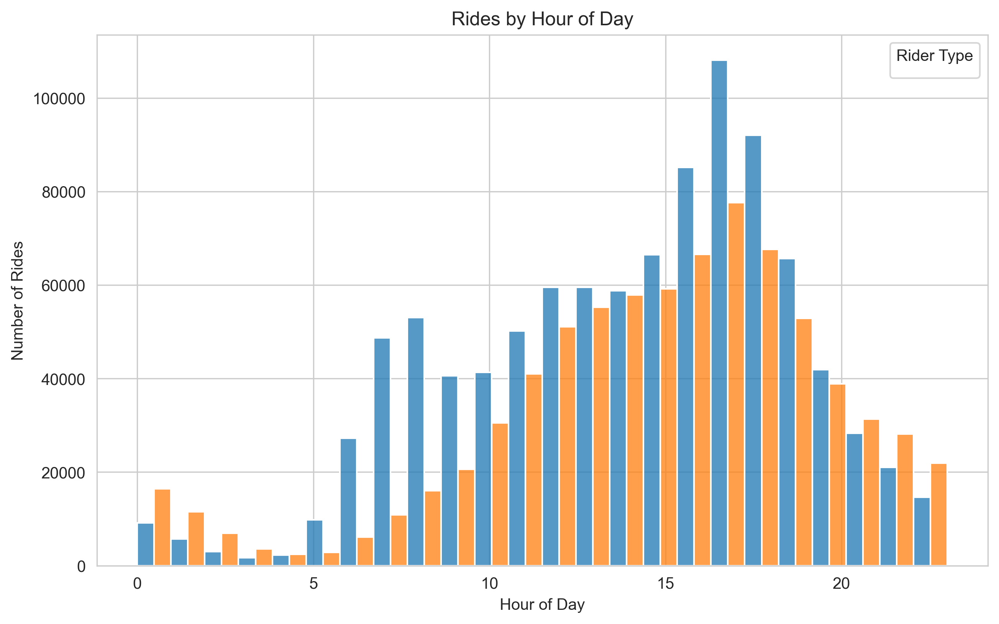

# Cyclistic Bike-Share Analysis

**Google Data Analyst Capstone Project**  
**Business Question:** How do annual members and casual riders use Cyclistic bikes differently?

### Project Overview
As part of the Google Data Analyst Certificate, I analyzed 12 months of real Cyclistic (Divvy) bike-share trip data (~4.5 million rides) in Chicago. The goal was to understand the key behavioral differences between casual riders and annual members and provide actionable marketing recommendations to help convert casual riders into annual members.

### Tools Used
- Python (Pandas, Matplotlib, Seaborn) – Data cleaning, analysis, and visualizations
- Tableau Public – Interactive dashboard
- Excel – PivotTables and charts

### Key Insights
- Casual riders take significantly longer rides (average **32.5 minutes**) compared to annual members (**13.2 minutes**)
- Casual riders heavily use bikes on weekends (leisure/tourism)
- Annual members show consistent weekday usage (commuting pattern)

### Deliverables
- [Python Jupyter Notebook](Cyclistic_Bike_Share_Analysis.ipynb)
- [Excel Analysis with PivotTables](Cyclistic_Bike_Share_Analysis_Excel.xlsx)
- [Interactive Tableau Dashboard](https://public.tableau.com/views/CyclisticBike-ShareAnalysisFaribaKazi/CyclisticDashboard)
  
### Visualizations

**Rides by Hour of Day** — Annual members (red) show clear commuter peaks in the morning and late afternoon, while casual riders (gold) stay flatter throughout the day.

**Average Ride Length by Rider Type** — Casual riders take noticeably longer trips on average than annual members.
 

**Average Ride Length by Day of Week** — Ride durations stay longest on Sundays, reflecting casual/leisure usage on weekends.
 

**Number of Rides by Day of Week** — Total ride volume by day, split by rider type. Members dominate overall, with strong midweek usage.
 

**Rides by Hour of Day** — Annual members (red) show clear commuter peaks in the morning and late afternoon, while casual riders (gold) stay flatter throughout the day.
 

### Top 3 Recommendations
1. Launch weekend-focused membership promotions targeting casual riders who take longer leisure rides.
2. Promote annual membership as the convenient and cost-effective choice for weekday commuters.
3. Use personalized digital campaigns (social media + email) based on rider behavior patterns.

**Author:** Fariba Kazi  
**LinkedIn:** www.linkedin.com/in/fariba-kazi
